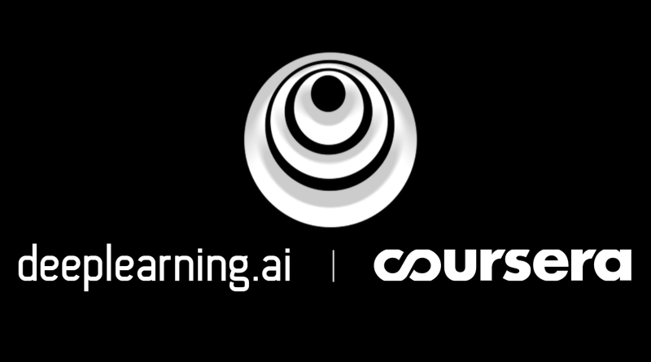

# Online Course Certificates

In this repository I keep copies of certificates obtained upon completion of online courses. Below is a short description of the courses I have completed.

##### Table of Contents  

- [Coursera](#coursera)

  * [Deep Learning Specialization](#deep-learning-specialization)

- [Udemy](#udemy)

  * [The Ultimate MySQL Bootcamp - Go from SQL Beginner to Expert](#the-ultimate-mysql-bootcamp---go-from-sql-beginner-to-expert)

  * [Microsoft Power BI - Business Intelligence for Beginners](#microsoft-power-bi---business-intelligence-for-beginners)

---

# Coursera

## Deep Learning Specialization

<!--  -->

This Specialization is an introduction to Deep Learning taught by Andrew
Ng. It consists of five courses, which cover the foundations of Deep Learning, how to build neural networks, and how to lead successful machine learning projects. Topics such as Convolutional networks, RNNs, LSTM, Adam, Dropout, BatchNorm, Xavier/He initialization, and more were covered. Python, Keras and TensorFlow were used.

### Courses

1. **Neural Networks and Deep Learning**

    In this course the foundations of deep learning were introduced.

2. **Improving Deep Neural Networks: Hyperparameter tuning, Regularization and Optimization**

    This course taught the *"magic"* of getting deep learning to work well. Topics
    covered:
    - industry best-practices for building deep learning applications
    - common neural network *"tricks"* including initialization, L2 and dropout regularization, batch normalization, and gradient checking
    - a variety of optimization algorithms, such as mini-batch gradient descent, momentum, RMSprop and Adam and check for their convergence
    - understand new best-practices for the deep learning era of how to set up train/dev/test sets and analyze bias/variance
    - how to implement a neural network in TensorFlow

3. **Structuring Machine Learning Projects**

    This course is concerned with how to build a successful machine learning project.
    Topics covered:
    - how to diagnose errors in a machine learning system and how to prioritize the most promising directions for reducing error
    - complex ML settings, such as mismatched training/test sets, and comparing to and/or surpassing human-level performance
    - how to apply end-to-end learning, transfer learning, and multi-task learning

4. **Convolutional Neural Networks**

    This course teaches how to build convolutional neural networks and apply it to image data. Topics covered:
    - how to build a convolutional neural network, including recent variations such as residual networks
    - how to apply convolutional networks to visual detection and recognition tasks
    - how to use neural style transfer to generate art
    - application of these algorithms to a variety of image, video, and other 2D or 3D data.

5. **Sequence Models**

    This course teaches how to build models for natural language, audio, and other sequence data. Topics covered:
    - how to build and train Recurrent Neural Networks (RNNs), and commonly-used variants such as GRUs and LSTMs
    - application of sequence models to natural language problems, including text synthesis
    - application of sequence models to audio applications, including speech recognition and music synthesis

# Udemy

## The Ultimate MySQL Bootcamp - Go from SQL Beginner to Expert

[This 20 hour course](https://www.udemy.com/course/the-ultimate-mysql-bootcamp-go-from-sql-beginner-to-expert/) is a gentle but comprehensive introduction to SQL and MySQL.
It covers such things as:

- MySQL DBMS
- SQL syntax
- logical operators and string functions
- dates and times
- Analyse data using Aggregate Functions
- SQL joins
- How to create databases and interacting with existing databases
- How to work with large datasets
- Write complex SQL queries across multiple tables
- Design and implement complex database schemas
- Database triggers
- Model real-world data and generate reports using SQL
- Answer company performance or sales questions using data
- Build a web app using NodeJS and MySQL
- Write Javascript code to generate fake data sets

## Microsoft Power BI - Business Intelligence for Beginners

[This 32 hour course](https://www.udemy.com/course/business-data-analysis-using-microsoft-power-bi/) is a gentle but comprehensive introduction to Power BI.
It covers such things as:

- An introduction to Power BI Desktop and Power BI Service

- Data analysis and business intelligence with Power BI

- Import Data from many different sources: CSV, Excel, MS SQL Server, the web, etcetera.

- Prep, clean and shape Data with Power BI

- Dataflows

- Visualisation with Power BI: bar charts, line charts, pie charts, stacked bar
charts, clustered column charts, area charts , combo charts, scatter charts, treemap
charts, funnel charts, cards and multi-row cards, gauge cards, KPIs, matrices, tables,
text boxes, shapes, images, slicers, maps and custom visuals such as word clouds.

- Filtering and highlighting

- Visualisation interactions

- Analytics

- Creating and importing themes

- Data modelling

- OLTP vs OLAP

- Normalisation and denormalisation. Star versus snowflake schemas.

- Publishing and sharing reports

- DAX

- Various business intelligence projects

- Personal and enterprise gateways

  - On-premises gateways

  - Personal versus enterprise gateways

  - Install and configure personal and enterprise gateways

  - Manage SQL Server data source through an enterprise gateway

- Power BI Service

  - Dashboards, reports, workspaces, Apps, datasets

  - Sharing and collaboration

    - Sharing dashboards, workspaces, Apps, and publishing to the web

- Power BI best practices, tips and tricks
